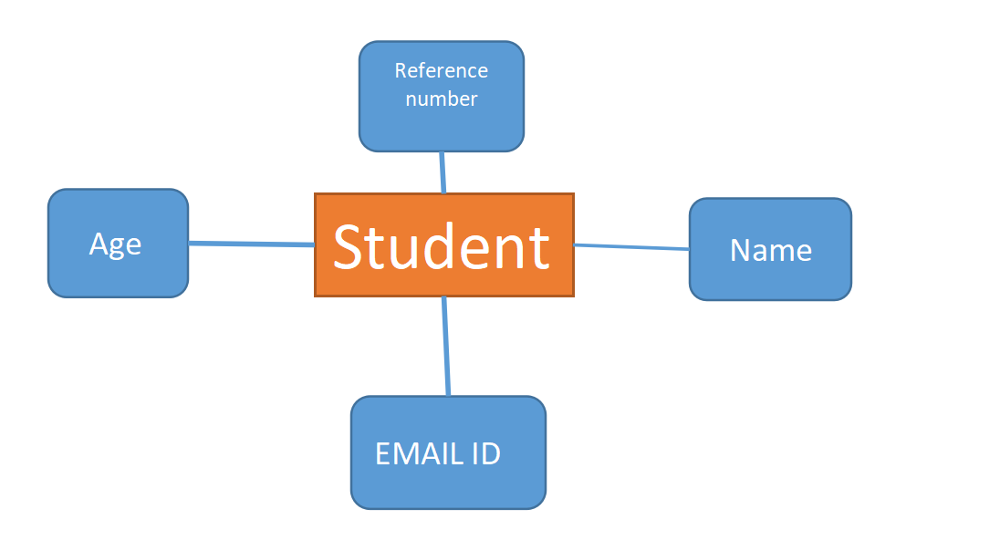
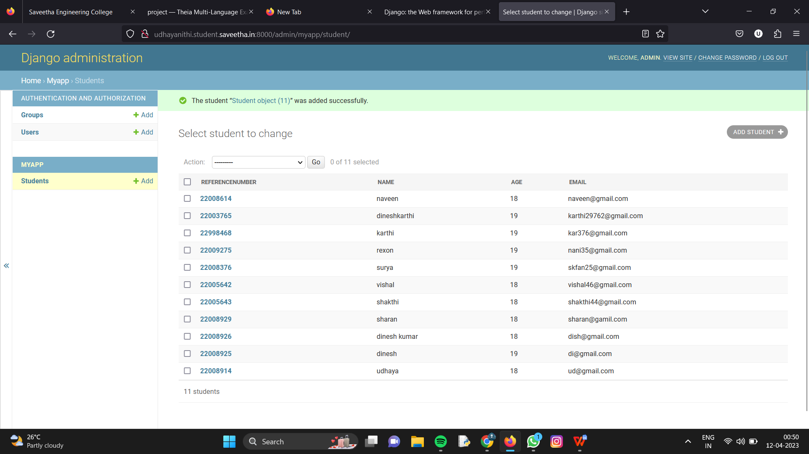

# Django ORM Web Application

## AIM
To develop a Django application to store and retrieve data from a database using Object Relational Mapping(ORM).

## Entity Relationship Diagram



## DESIGN STEPS

### STEP 1:
Clone repositry from gitub

### STEP 2:
Create an  admin interface for Django

### STEP 3:
Create an app edit setings.py
 
### STEP 4:
makemigrations and the migrate changes 

### STEP 5:
Make all the migrations 'myapp'

### STEP 6:
create an student database.

## PROGRAM

```
admin.py


from django.contrib import admin
from .models import Student,StudentAdmin


# Register your models here.
admin.site.register(Student,StudentAdmin)

models.py


from django.db import models
from django.contrib import admin


# Create your models here.
class Student (models.Model):
    referencenumber=models.CharField(max_length=20,help_text="reference number")
    name=models.CharField(max_length=100)
    age=models.IntegerField()
    email=models.EmailField()


class StudentAdmin(admin.ModelAdmin):
    list_display=('referencenumber','name','age','email')
```

## OUTPUT




## RESULT
The program for creating an student database using ORM is execute sucessfully